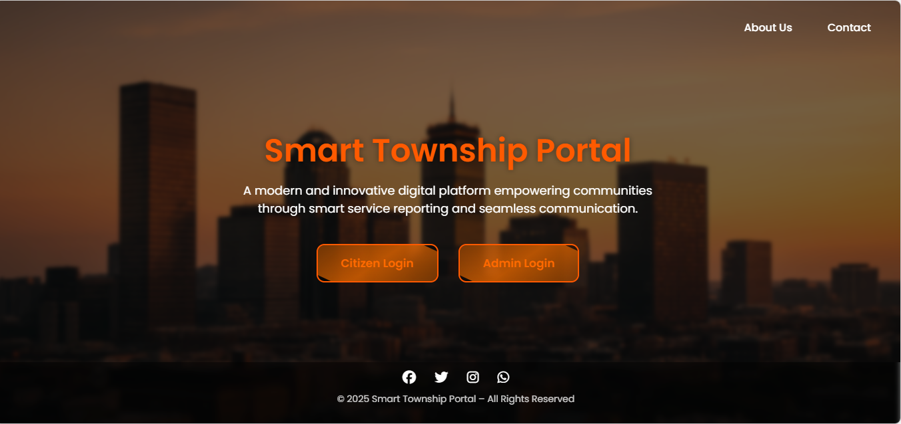
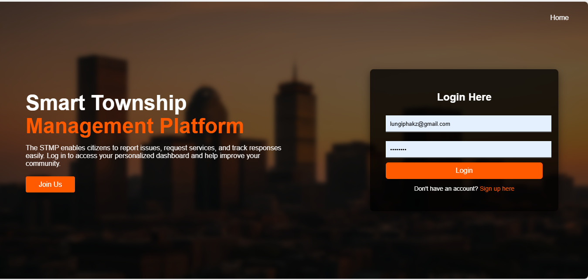

# Smart Township Portal

Smart Township Portal is a web-based digital platform designed to improve service delivery and communication within township communities. The system enables residents to report service-related issues, track progress, and receive updates, while administrators manage and resolve reported cases efficiently.

This project is currently **under active development** and forms part of my professional growth and practical experience in full-stack web development.

---

## 🎯 Project Purpose

The goal of Smart Township Portal is to:
- Empower township residents through transparent service reporting
- Improve response times and accountability
- Create a centralized system for issue management
- Demonstrate real-world web system design and implementation

---
## 🚧 Development Status

> **Status:** In Progress ⚙️

- ✅ Citizen (User) side largely implemented
- 🔄 Admin dashboard still under development
- 🔄 System enhancements and security improvements ongoing
- 🚀 Live deployment planned after core features are completed

This repository will be continuously updated as development progresses.

---

## 👥 Target Users

- **Citizens:**  
  Report issues, track service requests, and receive updates
  
- **Administrators (In Progress):**  
  Manage reports, assign tasks, monitor progress, and generate insights

---

## 🛠️ Technologies Used

- **Backend:**  (PDO)
- **Frontend:** , , 
- **Database:** 
- **Version Control:** , 
- **Development Tools:** , 

---
## 🖼️ Screenshots

### Home Page

### Registration Page

### Login Page

### Citizen Dashboard

---

## 🚀 Future Plans

- Complete admin dashboard
- Improve reporting and analytics
- Enhance security and validation
- Deploy live on a PHP hosting platform
- Add documentation and demo access

---
## 📌 Author

**Lungile Phakathi**  

---
## 📄 License

This project is intended for academic, learning, and portfolio purposes.
---

*Note: Admin-side features and full system deployment will be available soon.*
